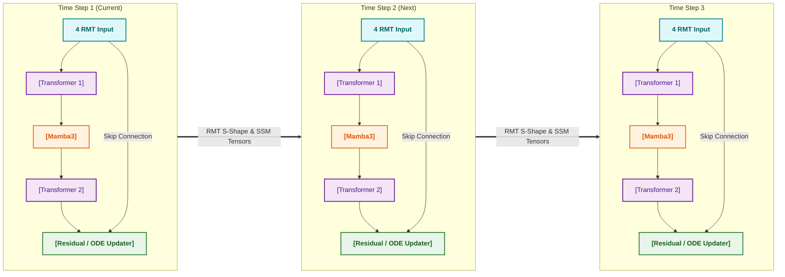

```mermaid
flowchart LR
    %% Set up custom classes for beautiful color styling
    classDef rmt fill:#e0f7fa,stroke:#00838f,stroke-width:2px,color:#006064,font-weight:bold;
    classDef ssm fill:#fff3e0,stroke:#ef6c00,stroke-width:2px,color:#e65100,font-weight:bold;
    classDef trans fill:#f3e5f5,stroke:#6a1b9a,stroke-width:2px,color:#4a148c;
    classDef res fill:#e8f5e9,stroke:#2e7d32,stroke-width:2px,color:#1b5e20,font-weight:bold;

    subgraph Step_1 ["Time Step 1 (Current)"]
        direction TB
        RMT_1["4 RMT Input"]:::rmt
        Trans1_1["[Transformer 1]"]:::trans
        Mamba_1["[Mamba3]"]:::ssm
        Trans2_1["[Transformer 2]"]:::trans
        Res_1["[Residual / ODE Updater]"]:::res

        RMT_1 --> Trans1_1
        Trans1_1 --> Mamba_1
        Mamba_1 --> Trans2_1
        Trans2_1 --> Res_1
        RMT_1 -- "Skip Connection" --> Res_1
    end

    subgraph Step_2 ["Time Step 2 (Next)"]
        direction TB
        RMT_2["4 RMT Input"]:::rmt
        Trans1_2["[Transformer 1]"]:::trans
        Mamba_2["[Mamba3]"]:::ssm
        Trans2_2["[Transformer 2]"]:::trans
        Res_2["[Residual / ODE Updater]"]:::res

        RMT_2 --> Trans1_2
        Trans1_2 --> Mamba_2
        Mamba_2 --> Trans2_2
        Trans2_2 --> Res_2
        RMT_2 -- "Skip Connection" --> Res_2
    end

    subgraph Step_3 ["Time Step 3"]
        direction TB
        RMT_3["4 RMT Input"]:::rmt
        Trans1_3["[Transformer 1]"]:::trans
        Mamba_3["[Mamba3]"]:::ssm
        Trans2_3["[Transformer 2]"]:::trans
        Res_3["[Residual / ODE Updater]"]:::res

        RMT_3 --> Trans1_3
        Trans1_3 --> Mamba_3
        Mamba_3 --> Trans2_3
        Trans2_3 --> Res_3
        RMT_3 -- "Skip Connection" --> Res_3
    end

    %% Temporal Flow & Recurrent Transitions (at the subgraph level to prevent layout flattening)
    Step_1 ===> |"RMT S-Shape & SSM Tensors"| Step_2
    Step_2 ===> |"RMT S-Shape & SSM Tensors"| Step_3
```
